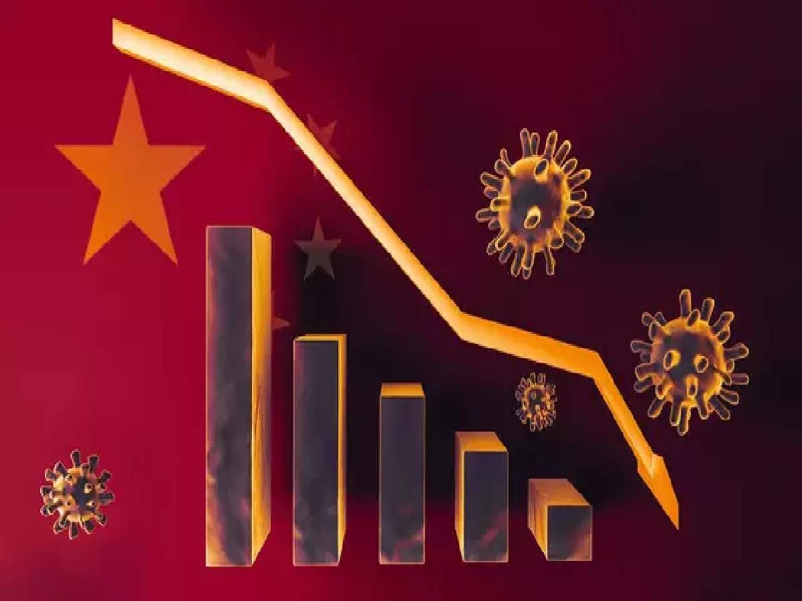

The unprecedented outbreak  COVID-19 had changed our life to a different path way.

Financial safety is a major concern. The limited economic activity, due to covid19 has caused everyone to be panic .

The future may be uncertain and it is critical dor atleast next 5 years.

Apart from migrant workers the worst affected is salaried employees, micro and small business income people's

They are categorised as  Budgeted, High Budgeted and Heavy budget class of peoples based on the committed expenditures.

The source of income for middle and micro business people are like salaries, business income, rental income,  pension, interest from fixed deposits, mutual fund and dividends from companies etc.,  

The expenditure's are going to be common which includes education fees,  groceries, rent to house or shops or business place, EMI( 2&4 wheeler , house, flat etc).
Expenditures on electricity , and medical amongst others.

The catastrophic effect of pandemic covid-19 is going to be Loss of job, Reduction in salary,  Buying Capacity ,  Reduction in manufacturing products and among others.

The central  Government never ever addressed the consequences faced by the Salaried, Middle icome Business group's which  arised  due to covid19 lockdown.

The moratorium for EMI by RBI is not a boon to Budgeted income  Group's.
Similarly the loan offers never helpful for salaried small, micro group of business people , when they are big crisis to pay back previous loan's.

Congress president Mrs. Gandhi, Parliamentiarn shri. Rahul Gandhi repeatedly requested for tax breaks / relief for the middle income salary groups and for middle income  business  group's. 

It was a great surprise the central government unpopular  20 lakh crore relief Measures had never mention anything for salaried and middle income business peoples.

Prime minister  Mr.Modi and 
Finance minister Mrs. Nirmala sitharaman  should listen to the opposition parties suggestions  for the benefits of salaried employees, micro and small business income people's , the real contributors to the Indian economy.

Highest relief  for the salaried employee and middle income business group's will be 

1. Deferred the period of EMI 
2. Tax breaks 
3. Education fees and Educational loans to be waived off for the year 2020-2021. 
4. Tax relief measure to middle income business group's
5. Tax relief and subsidiary measure to Educational institutes
6. Direct cash transfer to small, msme and educational services 
7. Subsidiary to Small , micro , service industries

Did the government will think and do the needful??

Let's Hope.....

