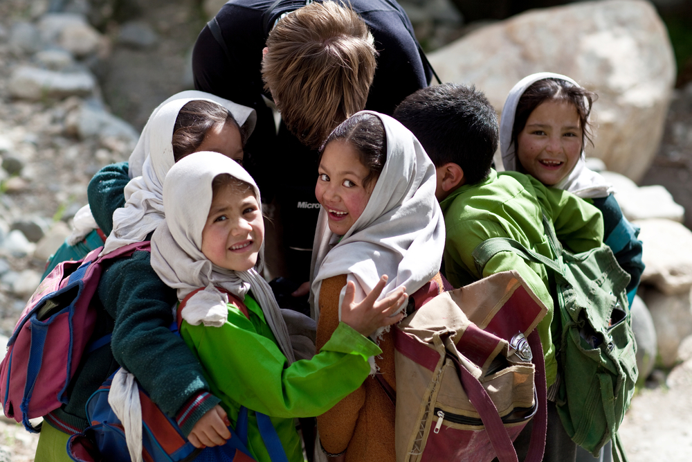
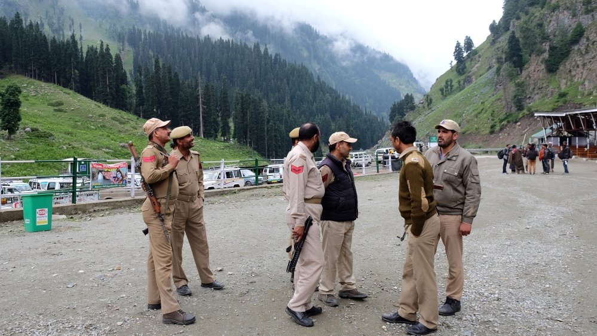
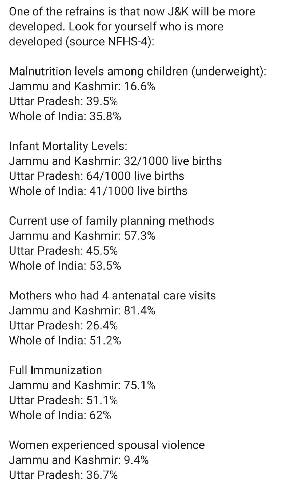

######History
Article 370 has been introduced into the constitution as a special provision for state of Jammu and Kashmir. When the signature of accession was made by Raja Hari Singh, Sheik Abdullah was in jail. He has been released and brought to Delhi. With Sardar Patel and Nehru earmarked upon Kashmir Agreement to bring people of Kashmir on board. Through Article 370 and 35a accession of Kashmir to India was complete, Sheik Abdullah had complete faith on both Kashmiris and India. Till now there are many Pro-Indian Politicians in Jammu and Kashmir.

> Though Art 370 gives Kashmir complete Freedom in matters of Judicial, Economic, Political and Legislative arrangements. Later years have seen weakening of this arrangement from time to time and indian governments exercised control over Kashmir through various checks and balances barring personal laws, Proprietary laws (Land etc) and few symbolic freedoms (Flag).

######Why Special Status for Jammu and Kashmir?
Kashmir is the most strategically important state for India. It is the only natural barrier from two problematic neighbor states. Rest is all plains and External Security is guaranteed, with Local Population being the most effective Intelligence providers of any possible infiltration. Remember Kargil war where the shepherd first informed the army about the infiltrations.

For this to have local population on the our side is very important. And this provision has given India the leverage of the support of local population.

######Insurgency
Major Problem in Kashmir has been Insurgency which picked up since late 80s leading to exodus of Kashmiri Pandits, and large riots killing local Muslims as well. From then peace in Kashmir has only been in interval.

######Important Stakeholders of this Issue
Jammu and Kashmir has 5 major stake holders politically.
1. Right wing Parties like BJP
2. Centerist Indian National Congress
3. Regional Pro Indian Parties like National Conference
4. Pro Separatist PDP
5. Separatist Hurriyat Elements.

Indian policy has always been to bring the youth away from Separatist and Terrorist elements and give them a vent to join Mainstream politics. PDP has served this purpose well untill 2014.

Infiltration and Terrorist elements has always been in Kashmir but the efforts of bringing Youth away from Hurriyat and Terror elements has been subsumed when PDP joined hands with BJP, PDP sympathisers has gone away from mainstream politics who are readily wooed by far Anti Indian elements.

Present Generation of Youth has never seen a peaceful Kashmir. After Insurgency and AFSPA, Kashmir has always been in Turmoil.

Poverty, Loss of Tourist Economy, Losses on Kashimri Exports, Lack of development works because of No Constant Peace. All bundled have lead to frustration and given an easy bait to extremist forces in the valley. Plains where the agriculture is profitable is still peaceful.

After 2014 BJP-PDP alliance has pushed them further. There is complete lack of Trust and Feeling of Suppression in Kashmiri Youth towards India and Increased with Shootup in the figures of Civilians in Firing (Not Posting figures but Govt data available)

1. I have huge doubts on legality of it and SC will come up with the solution. I have faith in it.
2. There is no doubt the sprit of Constitution has been murdered, yet has been done before in Independent India.
3. Major concern is the Trust of Kashmiris. This scrap down with Complete Black out of the state, with all former CMs being arrested and sent to jail. With no voice of Kashmiri ever heard. This will only alienate them further.
4. Our Intelligence channels doesn't look working with series of attacks on army posts in Kashmir, Our major source of Intelligence The Local population has every possibility to turn their backs on us.
5. Kashmir has seen highest recruits for insurgency in last five years and I can't imagine the future.
6. Indian economy is in itself in doldrusm, Investments in Kashmir that too against the wishes of People of Kashmiri is still a mystery for me.

The whole article is weaved around people of Kashmir the real stakeholders and Not People of Rest of India. Their assurances and their willingness and most importantly trust is all that matters to this article.

This article makes sense only when Rest Cares for the feelings and Rights of Kashmiris. If only Plots matter and Not people. Feel free to squash this article as Anti National.

For me Extraordinary Situation throws up Extra Ordinary people and this Scrapping of Article has made things clear who's here to be a politician and who is ready to be a leader against all odds. Popular Opinion on this has been overwhelming, but it only takes far looking leaders to stand against the opinion to voice the truth.

For India this scrapping will help serve its Ego, I know this India doesn't like privileges of any kind. This abrogation rightly been served to satisfy the Pride of India.

Talking about development of Kashmir. Kashmir is doing much better than many Stated in all health and family parameters even in stark economic and terror climate. All they need is a vision for life and space to express themselves.

