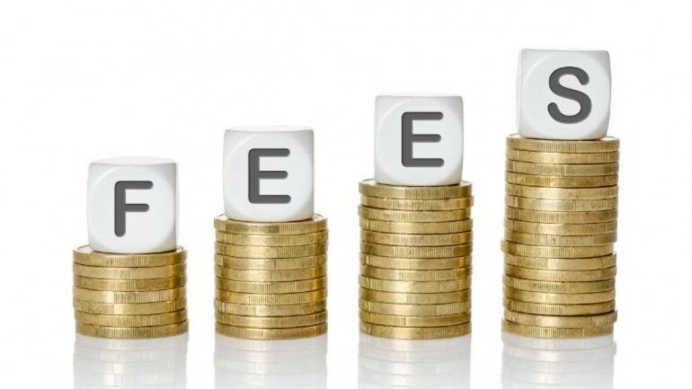

The educational fees of the students studying in schools and colleges at Government and private sector has to be borne by Central and state government for financial year 2020 -2021.Similarly student education loans has to be be waived off.

---

Covid-19 and total Lockdown has changed the life of people to tragedy particularly for upper, middle and lower class salary peoples and Daily wages peoples of India.

The salaried and daily wages people life has been totally disturbed, as they are all totally depend upon the income through which they are taking care of the family. The savings, which are minimal, due to the cost of living is also got exhaust. These class of people are burdened by EMI ,rent , education fees of the children's, medical expenditures etc.,

Responsibility and Duty of the Government is to take care of its citizens. Government has given some adhoc measures like Rs.500 to Jandhan account, farmers payments has been advanced etc., On the analysis of the actions on covid19 measures by state and Central Government cannot be appreciated on executing their duties and responsibilities.

The approach of state and Central Government's towards covid-19 measures such as the delayed announcement of lockdown, improper planning, no action for the migrant labours, financial assistance to the the lower income peoples are not properly done by the state and Central Government.

The actions on these parameters are total Chaos.

To the height of the wrong measures done by these governments are opening up the liquor shops and during lockdown period a total shutdown was implemented.

This create the total Chao's among the people and it becomes bas crowd pulling areas to collect the essential commodities etc. This activity resulted in total broke down of social distance between the peoples and give the pave way for the cluster of patients of covid-19

With all these things the extension of lockdown or restriction become an eminent domain. The burden on the backbone is going to much for a common citizen of India.

As a relief measure the government has to declare waive of to the education fees for this year(2020-2021) studying at Government and private institutions in schools and colleges.

National Students Union of India (NSUI), the students Wings of Congress is demanding the Government to waive off all the educational fees.

The demand is welcomed and widely appreciated by people of India as it shall relief some of their burdens.

In addition to that the Government should give tax waiver and subsidiary to the educational institutions as they should run this academic year.

By giving subsidiary and tax waiver to the education institution ,they can support the students, with adequate teaching and non teaching staff's. Government should give interest free loans( may be for limited financial years) to education institutions for the development of the infrastructures, which can be monitor through the State or Central Government .

Expecting the State and Central Government shall have a discussions on the educational sectors for the tax waiver, subsidy and interest free loans to institutions to support the educationalist and total waive off on the student educational loans to reduce the burden of upper, lower Middle class income people and Daily wages peoples of this country.
